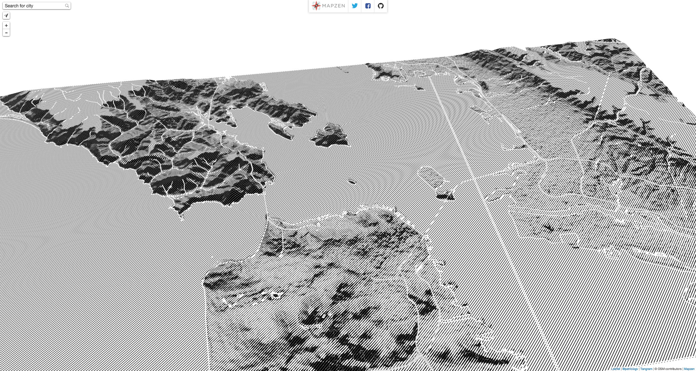
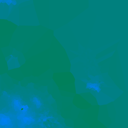
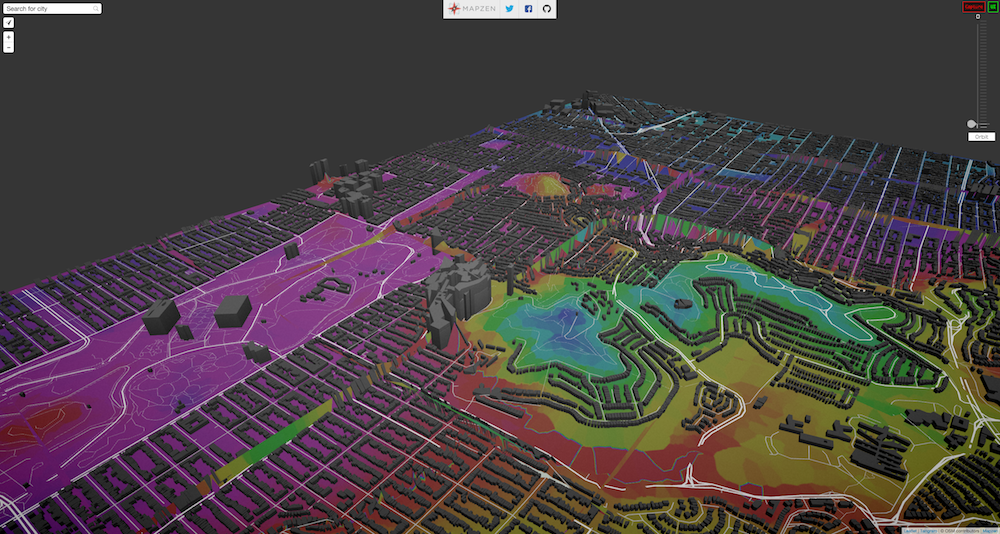
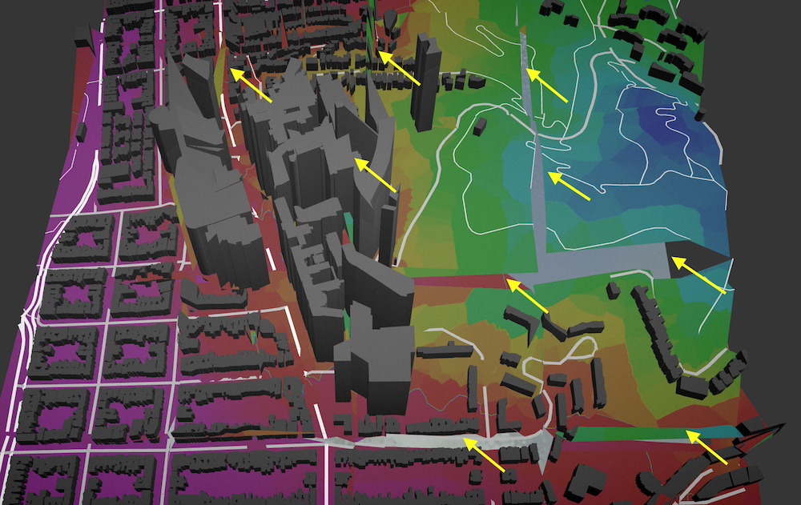
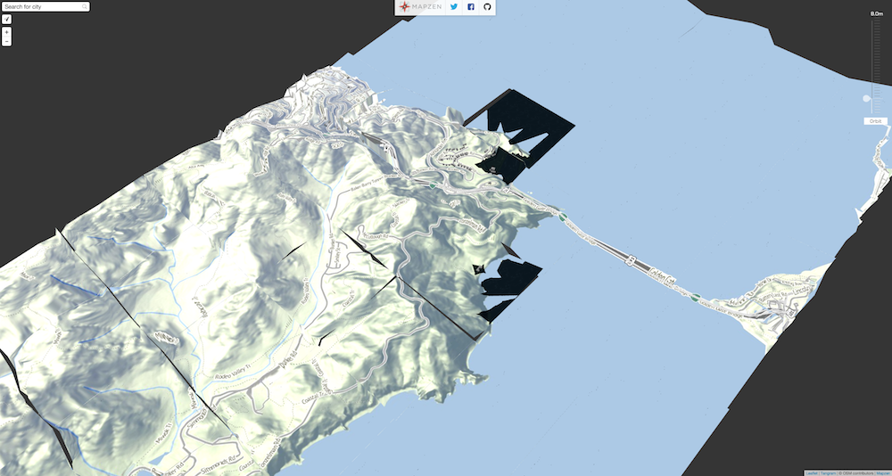

# Terrarium

A series of experiments on terrain and elevation data for [Tangram](https://mapzen.com/projects/tangram) ignited by [Patricio Gonzalez Vivo](https://twitter.com/patriciogv) and powered by almost everybody in [Mapzen](http://www.mapzen.com)

## Log

### 12-04-15: Approach A, One big image to rule them all 

My first approach was to download a heightmap from the [Shuttle Radar Topography Mission](http://www2.jpl.nasa.gov/srtm/) through [Derek Watkins’s](https://twitter.com/dwtkns) [tool](http://dwtkns.com/srtm30m/) and simply project the vertices on the vertex shader.


After downloading and unzipping the tile from [Shuttle Radar Topography Mission](http://www2.jpl.nasa.gov/srtm/), I converted it to a PNG using [gdal](https://www.mapbox.com/tilemill/docs/guides/gdal/):

```bash
wget http://e4ftl01.cr.usgs.gov/SRTM/SRTMGL1.003/2000.02.11/N37W123.SRTMGL1.hgt.zip
tar xzvf N37W123.SRTMGL1.hgt.zip
gdal_translate -ot Int16 -of PNG N37W123.hgt N37W123.png
```

Downloading and inspecting the [JSON file with the bounding boxes](http://dwtkns.com/srtm30m/srtm30m_bounding_boxes.json) from [Derek Watkins’s](https://twitter.com/dwtkns) [tool](http://dwtkns.com/srtm30m/), I determine the boundaries of that tile. Which then I export to webmercator:

```
[-13692328.289900804, -13580946.954451224, 4439068.068371599, 4579465.0539420955]
```

Later I feed this values into a vertex shader on [Mapzen’s Map Engine](https://github.com/tangrams/tangram) together with a ```MINZ``` and ```MAXZ``` for the elevation range:

```yams
geometry-terrain:
        animated: true
        mix: [generative-caustic, geometry-matrices, functions-map, filter-grain]
        shaders:
            uniforms:
                u_terrain: data/A/N37W123.png
                u_water_height: 0.
            defines:
                XMIN: -13692328.289900804
                XMAX: -13580946.954451224
                YMIN: 4439068.068371599
                YMAX: 4579465.0539420955
                ZMIN: -10.0
                ZMAX: 800.0
            blocks:
                global: |
                    bool inZone(vec2 _worldPos) {
                        return  _worldPos.x > XMIN && _worldPos.x < XMAX &&
                                _worldPos.y > YMIN && _worldPos.y < YMAX;
                    }

                    float getNormalHeight(vec2 position) {
                        vec2 worldPos = u_map_position.xy + position.xy;
                        if (inZone(worldPos)) {
                            vec2 st = vec2(0.0);
                            st.x = (worldPos.x-XMIN)/(XMAX-XMIN);
                            st.y = (worldPos.y-YMIN)/(YMAX-YMIN);
                            return texture2D(u_terrain, st).r;
                        } else {
                            return 1.1;
                        }
                    }

                    void extrudeTerrain(inout vec4 position) {
                        vec2 pos = position.xy;
                        float height = getNormalHeight(pos.xy);
                        if (height <= 1.0) {
                            position.z += ZMIN+height*(ZMAX-ZMIN);
                        }
                    }
```

In the code above you can see how I’m checking if the vertex is inside the zone for where I have elevation data. If that’s true it extrudes the vertices.


Sometimes the polygons that form the ```earth``` layer on OSM don’t have enough subdivisions and the vertices are extruded in a way that hides important features like roads and buildings, as seen in the image below.


To fix this I generate a custom set of plane tiles with subdivisions on important corners (coming from polygons and lines from OSM ```earth```, ```roads``` and ```landuse``` layers)


By breaking the tiles into small fragments, the extrusion of the terrain doesn’t hide the geometry.


Running this script using the USGS ID (default: `N37W123`) and zoom levels (default: `3-17`) will create the necessary tiles:

```bash
cd data
python makeATiles.py [USGS_ID] [ZOOM_RANGE]
```

Once the tiles are done and you look at the map in higher zoom levels, a new problem might emerge: 


The top of the buildings have been extruded according to the heightmap, but in a incongruent way. To fix this issue we developed a new approach.

Data Sources:

* [Shuttle Radar Topography Mission](http://www2.jpl.nasa.gov/srtm/) through [Derek Watkins’s](https://twitter.com/dwtkns) [tool](http://dwtkns.com/srtm30m/)

* [OpenStreetMap](http://www.openstreetmap.org/)

* [Mapzen’s vector tiles](https://mapzen.com/projects/vector-tiles)

#### 12–05-15: Parallel explorations, Normalmap


It is possible to illuminate the surface of the terrain by adding “normal” information to [Tangram](https://github.com/tangrams/tangram)’s light engine. (The [normal](https://mapzen.com/documentation/tangram/Materials-Overview/#normals) of a polygon is a three-dimensional vector describing the direction that it is considered to be facing, which affects the color and shininess of the polygon.)


We can make the NormalMap using the HeightMap we got from the [Shuttle Radar Topography Mission](http://www2.jpl.nasa.gov/srtm/) using GIMP or the Tangram shader [here](https://github.com/patriciogonzalezvivo/terrarium/blob/master/data/normal.frag) using [glslViewer](https://github.com/patriciogonzalezvivo/glslViewer) like this:

```bash
cd data/
glslViewer normal.frag A/N37W123.png -o A/N37W123-normal.png
```

On the fragment shader we can use the following function to retrieve the normal values for each point…

```gals
vec3 getNormal(vec2 position) {
	vec2 worldPos = u_map_position.xy + position.xy;
	if (inZone(worldPos)) {
		vec2 st = vec2(0.0);
		st.x = (worldPos.x-XMIN)/(XMAX-XMIN);
		st.y = (worldPos.y-YMIN)/(YMAX-YMIN);
		return texture2D(u_normalmap, st).rgb*2.-1.;
	} else {
		return vec3(0.,0.,1.);
	}
}
```

and then use it on the YAML scene to modify the normals on the fragment shader:

```yams
	normal: |
		normal.gb = getNormal(v_orig_pos.xy);
```

Once the terrain is “lit”, the terrain looks like this:


Once I knew the lightening was right I try some non-realistic shading of it to understand better the use of this information:



### 12–05-15: Parallel explorations, Under water

Using the bounding box of the image we downloaded from Shuttle Radar Topography Mission](http://www2.jpl.nasa.gov/srtm/), I can construct a big rectangular polygon in which to draw the water level.

I use a [Spherical Environmental Map](http://www.ozone3d.net/tutorials/glsl_texturing_p04.php) on it together with some fragment shader code to disturb the normals using a regular simplex noise function to make it look more “natural”.


The code for this ```water``` is the following:

```yams
    water:
        base: polygons
        animated: true
        mix: [geometry-matrices, filter-grain]
        blend: inlay
        material:
            ambient: .7
            diffuse:
                texture: ../imgs/sem-sky-0001.jpg
                mapping: sphere map
        shaders:
            uniforms:
                u_offset: [0, 0]
                u_water_height: 0.
            blocks:
                position: |
                    position.z += u_water_height;
                    position.xyz = rotateX3D(abs(cos(u_offset.x))*1.3) * rotateZ3D(cos(u_offset.y)*1.57075) * position.xyz;
                normal: |
                    normal += snoise(vec3(worldPosition().xy*0.08,u_time*.5))*0.02;
                filter: |
                    color.a *= .9;
```

Then on the rest of the geometry I apply the following [caustic filter](https://en.wikipedia.org/wiki/Caustic_(optics)) to everything that above the water level. 

```yams

        shaders:
            defines:
                TAU: 6.28318530718
                MAX_ITER: 3
            blocks:
                global: |
                    // Caustic effect from https://www.shadertoy.com/view/4ljXWh
                    vec3 caustic (vec2 uv) {
                        vec2 p = mod(uv*TAU, TAU)-250.0;
                        float time = u_time * .5+23.0;
                        vec2 i = vec2(p);
                        float c = 1.0;
                        float intent = .005;
                        for (int n = 0; n < int(MAX_ITER); n++) {
                            float t = time * (1.0 - (3.5 / float(n+1)));
                            i = p + vec2(cos(t - i.x) + sin(t + i.y), sin(t - i.y) + cos(t + i.x));
                            c += 1.0/length(vec2(p.x / (sin(i.x+t)/inten),p.y / (cos(i.y+t)/inten)));
                        }
                        c /= float(MAX_ITER);
                        c = 1.17-pow(c, 1.4);
                        vec3 color = vec3(pow(abs(c), 8.0));
                        color = clamp(color + vec3(0.0, 0.35, 0.5), 0.0, 1.0);
                        color = mix(color, vec3(1.0,1.0,1.0),0.3);
                        return color;
                    }
                     
                filter: |
										vec2 wordPos = u_map_position.xy + v_orig_pos.xy;
                    if (inZone(wordPos) && ZMIN+height*(ZMAX-ZMIN)+worldPosition().z < u_water_height) {
                        color.gb += caustic(worldPosition().xy*0.005)*0.2;
                    }
```

All of this makes the water looks like this:


This together with a slider updating the position of the uniform ```u_water_height``` allows a nice interactive animation of  the sea levels rising:


### 12-08-15: Approach B: Azulejos, an image per tile 

In order to solve the incongruence on building extrusion I thought it would be beneficial to have control over the heightmap. For that, we need to develop a new set of tiles. Each tile will have a double format of both GeoJSON and PNG images. The first will store the geometries explained on the previous section, plus the addition of building vertices, together with a PNG image that stores the elevation data in a useful and coherent way. For that I will fetch the elevation for just the present vertices using [Mapzen’s elevation service](https://mapzen.com/documentation/elevation/elevation-service/) and construct Voronoi tiled images from them.

 

The idea behind this approach is that vertices will fill ‘cells’ with a similar elevation. In the case of the buildings, all vertices should have the same height, and each cell of each corner will have the same value. This will work as a leveled “platform” for the building to rest upon, with out distorting the original roof elevation.


Because I’m composing the elevation images for each tile, we have way more control and curation of the data. This will allow us to increase the resolution and precision of the tile as we zoom in. But we still have another issue to resolve: Right now the elevation information is passed as a grayscale value, but the elevation range has to be hardcoded (look for ```ZMIN``` and ```ZMAX``` in the above code). If we are going to build tiles for the whole world we need a consistent way to pass this information rather than as a 1 bit value.

Checking with [Kevin](https://twitter.com/kevinkreiser) who is in charge of Mapzen’s elevation service, the elevation data have a precision of 2 bytes. A quick check on [wikipedia](https://en.wikipedia.org/wiki/Elevation) reveals the highest and lowest points on earth.


With an approximate range of -12000 to 9000 meters, color channels (GB = 255*255 = 65025) can accommodate this data range. The python script in charge of making the raster elevation tiles now looks like this...

```python
	elev_unsigned = 12000+elevation
	GREEN = math.floor(elev_unsigned/255)%255
	BLUE = math.floor(elev_unsigned%255)
``` 

which produces a image that looks like this:

 

On the vertex shader we will need to “decode” this value:

```glsl
	vec3 elev_color = texture2D(u_terrain, st).rgb;
	float height = -12000.0+elev_color.g*65025.+elev_color.b*255.;

```

Putting it all together, each tile is rendered into something that looks like this!


The necessary tiles can be created by running the script with the OSM ID (default: `111968`) and ZOOM RANGE (default: `3-17`)

```bash
cd data
python makeATiles.py [OSM_ID] [ZOOM_RANGE]
```

Data Sources

* [Mapzen’s elevation data](https://mapzen.com/documentation/elevation/elevation-service/)

* [OpenStreetMap](http://www.openstreetmap.org/)

* [Mapzen’s vector tiles](https://mapzen.com/projects/vector-tiles)

### 12-16-15: Improvements on azulejos, Faster Voronoi Algorith 

[Kevin Kreiser](https://twitter.com/kevinkreiser) improve the voronoi algorithm to rasterize B tiles faster. In his own words, here is the [comment on his PR](https://github.com/mapzen/terrarium/pull/2):

_so to properly display buildings without messing up their rooftops its nice to have an isoheight underneath them. @patriciogonzalezvivo added this by computing the brute force voronoi diagram where the cites were the building vertices, if i understand correctly. he mentioned though that the algorithm was very slow for complex scenes._

_So here we let opencv do the heavy work. it has methods which likely use a variant of fortunes algorithm to compute the voronoi diagram (and its dual the delaunay triangulation) in O(nlogn) time. this is way faster than brute force._

_another nice thing it does is allow us to rasterize the voronoi cells into a png fairly quickly. we do this by exploiting the fact that voronoi cells are always convex._

Kevin also suggest moving the offset to eliminate negative numbers to something that makes more sense than ```-12000``` (the lower point on earth) to ```-32768.``` the half of the 16bits range.  You can see this change [here](https://github.com/mapzen/terrarium/commit/63f490ae6b63abd1ead300f9fb3716d8b2cc8f0c#diff-187341f9e9312c2504f99aff18067126R361) and [here](https://github.com/mapzen/terrarium/commit/0130204c705112d842327e7fd761ba163fb7d5c1#diff-f38fabf13cc31a68d6f1714e50779b33R159)

Beside the significant increase in processing time, this changes made the B tiles more brighter and aquamarine blue, from that their current name [Azulejos](https://en.wikipedia.org/wiki/Azulejo)

 

I perform a “fast&dirty” modification to [Tangram.js](https://github.com/tangrams/tangram) to load a textures per tile in a similar. Here is [the commit](https://github.com/tangrams/tangram/commit/db5eeea6e60130a3acb0e6931f1dc6f1898d2b00) to in ```src/scene.js``` and ```src/tile.js```. Then by pointing to our tiles path in the yaml scene file:

```yaml
 sources:
    ohm:
        type: TopoJSON
        url: //vector.mapzen.com/osm/all/{z}/{x}/{y}.topojson
    terrain:
        type: GeoJSON
        url: data/B/{z}-{x}-{y}.json
    elevation:
        type: Raster
        url: data/B/{z}-{x}-{y}.png
```

Tangram will create and download a texture per tile using that formula and pass it to the ```u_[raster_source_name]``` in this case ```u_elevation```.

The GLSL Code in the style responsable for the extortion got way more clean and simplify:

```yaml
	geometry-terrain:
        mix: [space-tile, generative-caustic, geometry-matrices, filter-grain]
        shaders:
            uniforms:
                u_elevation: elevation
                u_offset: [0, 0]
                u_water_height: 0.
            defines:
                    ZOFFSET: 0
            blocks:
                global: |
                    varying vec3 v_orig_pos;

                    float getHeight() {
                        vec3 color = texture2D(u_elevation, getTileCoords()).rgb;
                        if (color.rg != vec2(0.0)) {
                            return -32768.+color.g*65025.+color.b*255.;
                        } else {
                            return -1.0;
                        }
                    }

                    void extrudeTerrain(inout vec4 position) {
                        vec2 pos = position.xy;
                        float height = getHeight();
                        if (height != -1.0) {
                            position.z += height;
                        }
                    }
                position: |
                    position.z += ZOFFSET*u_meters_per_pixel;
                    v_orig_pos = position.xyz;
                    extrudeTerrain(position);
                    position.xyz = rotateX3D(abs(cos(u_offset.x))*1.3) * rotateZ3D(cos(u_offset.y)*1.57075) * position.xyz;
                color: |
                    float height = getHeight();
                    vec2 wordPos = u_map_position.xy + v_orig_pos.xy;
                filter: |
                    if (height+worldPosition().z < u_water_height) {
                        color.gb += caustic(worldPosition().xy*0.005)*0.2;
                    }
```
 
As you can see the on the above code now the shader only need tile coordinates (```getTileCoords()```) to get the right pixel on the texture. This is how it looks:



Unfortunately this progress also bring a new error to solve. Looking closely to the above image you can see some geometry been erroneously extrude close to tile edges


This seams to be cause because building vertices tend to exceed the limits of a tile. Once this data is provide to the tile and process by the shader, probably is not finding information outside the tile edges.

Also it seams to be having the opposite problem when there is no vertices close enough to the edges.



For the next round of exploration I will consult with [Rob Marianski](https://twitter.com/rmarianski) how to only use the vertices inside a tile and add extra once to fill the spaces.

### 12-16-15: Parallel explorations, Using pre-shaded raster tiles on top of terrain geometry

Taking advantage of the changes made on Tangram to load raster tiles as per tile textures, is easy to use this images to shade the terrain.

```yaml
sources:
		…
    stamen:
        type: Raster
        url: http://spaceclaw.stamen.com/terrain/{z}/{x}/{y}.png
…
styles:
		…
    elevate_ls:
        base: polygons
        mix: [geometry-terrain]
        shaders:
            defines:
                    ZOFFSET: -1
            blocks:
                color: |
                    color.gb = texture2D(u_stamen, getTileCoords()).rgb;
```




## TODO’s

- Fix glitches on edge tile boundaries

- Add more vertices to compute on the GeoJson geometry tiles using **contour data**, so we are sure there is enough information to cover non urban areas.

- Under zoom level 12, geoJSON tiles are too big (~10mb in the worst scenario). These zoom levels may not need so much definition for the terrain geometry. Simplifying data coming from elevation contours and heightmap/normalmap may be enough. Contour/roads data is enough until between 1-14 as the buildings are too small to be visible. Or maybe just heightmap/normalmap is enough as users don’t really see the terrain under 12.
 
## Building your own set of terrarium tiles

### Requirements

You should install the following Python modules:

- [SciPy](http://www.scipy.org/install.html)

- PIL

```bash
sudo pip install pil
```

- [Requests](http://docs.python-requests.org/en/latest/user/install/#install)

```bash
sudo pip install requests
```

- NumPy:

```bash
sudo pip install numpy
```

- OpenCV for python:

```bash
sudo apt-get install python-opencv
```

- Shapely:

```bash
sudo apt-get install libgeos++
sudo pip install shapely 
```

If you are going to make A tiles (the first approach, described at the top of this post) you should also install [GDAL](https://www.mapbox.com/tilemill/docs/guides/gdal/).

## Making terrarium tiles

```bash
cd ~
git clone —depth 1 https://github.com/patriciogonzalezvivo/terrarium.git
cd terrarium/data
python makeTiles.py 111968 3-17
```

## How was part of this synergy project?

- [Patricio Gonzalez Vivo](https://twitter.com/patriciogv): Came up with the first round of A and B tiles ideas

- [Kevin Kreiser](https://twitter.com/kevinkreiser): improve the voronoi algorithm to rasterize B tiles faster

- [Rob Marianski](https://twitter.com/rmarianski): help us with his python tiling magic
 
