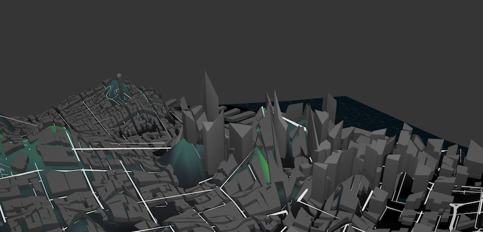

# Terrarium


Experiments on terrains by [Patricio Gonzalez Vivo](https://twitter.com/patriciogv) at [Mapzen](https://mapzen.com/).

## Process

### Approach A: One big image to rule them all 

#### Data Sources

* [Shuttle Radar Topography Mission](http://www2.jpl.nasa.gov/srtm/) through [Derek Watkins’s](https://twitter.com/dwtkns) [tool](http://dwtkns.com/srtm30m/)

* [OpenStreetMap](http://www.openstreetmap.org/)

* [Mapzen’s vector tiles](https://mapzen.com/projects/vector-tiles)

#### Log

My first approach was to download a heightmap from the [Shuttle Radar Topography Mission](http://www2.jpl.nasa.gov/srtm/) through [Derek Watkins’s](https://twitter.com/dwtkns) [tool](http://dwtkns.com/srtm30m/) and simply project the vertices on the vertex shader.


Once I download and unzip the tile from [Shuttle Radar Topography Mission](http://www2.jpl.nasa.gov/srtm/). I convert it to a PNG using [gdal](https://www.mapbox.com/tilemill/docs/guides/gdal/):

```bash
wget http://e4ftl01.cr.usgs.gov/SRTM/SRTMGL1.003/2000.02.11/N37W123.SRTMGL1.hgt.zip
tar xzvf N37W123.SRTMGL1.hgt.zip
gdal_translate -ot Int16 -of PNG N37W123.hgt N37W123.png
```

Downloading and inspecting the [JSON file with the bounding boxes](http://dwtkns.com/srtm30m/srtm30m_bounding_boxes.json) from [Derek Watkins’s](https://twitter.com/dwtkns) [tool](http://dwtkns.com/srtm30m/), I determine the boundaries of that tile. Which then I export to webmercator:

```
[-13692328.289900804, -13580946.954451224, 4439068.068371599, 4579465.0539420955]
```

Later I feed this values into a vertex shader on [Mapzen’s Map Engine](https://github.com/tangrams/tangram) together with a ```MINZ``` and ```MAXZ``` for the elevation range

```yams
geometry-terrain:
        animated: true
        mix: [generative-caustic, geometry-matrices, functions-map, filter-grain]
        shaders:
            uniforms:
                u_terrain: data/A/N37W123.png
                u_water_height: 0.
            defines:
                XMIN: -13692328.289900804
                XMAX: -13580946.954451224
                YMIN: 4439068.068371599
                YMAX: 4579465.0539420955
                ZMIN: -10.0
                ZMAX: 800.0
            blocks:
                global: |
                    bool inZone(vec2 _worldPos) {
                        return  _worldPos.x > XMIN && _worldPos.x < XMAX &&
                                _worldPos.y > YMIN && _worldPos.y < YMAX;
                    }

                    float getNormalHeight(vec2 position) {
                        vec2 worldPos = u_map_position.xy + position.xy;
                        if (inZone(worldPos)) {
                            vec2 st = vec2(0.0);
                            st.x = (worldPos.x-XMIN)/(XMAX-XMIN);
                            st.y = (worldPos.y-YMIN)/(YMAX-YMIN);
                            return texture2D(u_terrain, st).r;
                        } else {
                            return 1.1;
                        }
                    }

                    void extrudeTerrain(inout vec4 position) {
                        vec2 pos = position.xy;
                        float height = getNormalHeight(pos.xy);
                        if (height <= 1.0) {
                            position.z += ZMIN+height*(ZMAX-ZMIN);
                        }
                    }
```

In the above code you can see how I’m checking if the vertex is inside the zone for what I have elevation data. If that’s true it perform the extrusion of the vertices.


As can be notice the Polygons form the ```earth``` layer on OSM don’t have enough subdivisions and the vertices are extruded in a way that hide important features like roads and buildings (notice the errors generated on the image bellow).


To fix this I start making a custom set of plane tiles with subdivisions on important corners ( coming from polygons and lines from OSM ```earth```, ```roads``` and ```landuse``` layers)


In this way by breaking the tiles into small fragments the extortion of the terrain don’t hide geometry.


The creation of the necessary tiles could be done running the script followed by the USGS ID (default: `N37W123`) and zoom levels (default: `3-17`)

```bash
cd data
python makeATiles.py [USGS_ID] [ZOOM_RANGE]
```

Once the tiles are done and you watch the map in higher zoom levels could be appreciated a new problem. 



The top of the buildings have been extrude according to the heightmap but in a incongruent way. To fix this issue a new approach had to be develop


### Approach B: an image per tile

#### Data Sources

* [Mapzen’s elevation data](https://mapzen.com/documentation/elevation/elevation-service/)

* [OpenStreetMap](http://www.openstreetmap.org/)

* [Mapzen’s vector tiles](https://mapzen.com/projects/vector-tiles)

#### Log

In order to solve the incongruence on building extrusion I thought will be beneficial to have control over the heightmap. For that a new set of tiles need to be develop. Each tile will have a double format of GeoJSON and PNG Images. The first will store the geometries explained on the previous log plus the addition of building vertices, together with that a PNG image will be compose to store the elevation data in useful way to make coherent. For that I will fetch the elevation for just the present vertices using [Mapzen’s elevation service](https://mapzen.com/documentation/elevation/elevation-service/) and construct voronoi tiled images from them.

 

The idea behind this approach is that vertices will fill ‘cells’ with a similar elevation. On the case of the buildings, all vertices should have the same height, and each cell of each corner will have the same value. This will work as a leveled “platform” for the building to rest with out distorting the roof elevation from the original.


Because I’m composing the elevation images for each tile we have way more control and curation on the data. This will allow to increase the resolution of the tile conform we zoom in. But still he have another to resolve first. Right now the elevation information is pass as a grayscale value, an the elevation range have to be hardcoded (look for ```ZMIN``` and ```ZMAX``` in the above code). If we are going to build tiles for the hole world we need a consistent way to pass this information rather than a 1 bit.

Checking with Kevin in charge of the Mapzen’s elevation service, the elevation data have a precession of 2 bit. A quick check on [wikipedia](https://en.wikipedia.org/wiki/Elevation), revel the highest and lower points on earth.


With an approximated range between 9000 to -12000 meters using to color channels (GB = 255*255 = 65025) will be enough to accommodate this range. This on the python script in charge of making the raster elevation tiles look like this:

```python
	elev_unsigned = 12000+elevation
	GREEN = math.floor(elev_unsigned/255)%255
	BLUE = math.floor(elev_unsigned%255)
``` 

This produce a image that looks like this:

 

On the vertex shader we will need to “decode” this value by doing:

```glsl
	vec3 elev_color = texture2D(u_terrain, st).rgb;
	float height = -12000.0+elev_color.g*65025.+elev_color.b*255.;

```
<<<<<<< HEAD

Finally and all together each tile is hable to compose something that looks like this:


The creation of the necessary tiles could be done running the script followed by the OSM ID (default: `111968`) and ZOOM RANGE (default: `3-17`)

```bash
cd data
python makeATiles.py [OSM_ID] [ZOOM_RANGE]
```

### Parallel explorations

=======

Finally and all together each tile is hable to compose something that looks like this:


The creation of the necessary tiles could be done running the script followed by the OSM ID (default: `111968`) and ZOOM RANGE (default: `3-17`)

```bash
cd data
python makeATiles.py [OSM_ID] [ZOOM_RANGE]
```

### Parallel explorations

>>>>>>> f46e6cbe23e6569f0d16a4bcd2554479dc3f233f
#### Normalmap


Is possible to lighten the surface of the terrain by adding normal information to [Tangram](https://github.com/tangrams/tangram)’s light engine some NormalMap filtering to the HeightMap obtained from [Shuttle Radar Topography Mission](http://www2.jpl.nasa.gov/srtm/) using GIMP or the shader [here](https://github.com/patriciogonzalezvivo/terrarium/blob/master/data/normal.frag) through [glslViewer](https://github.com/patriciogonzalezvivo/glslViewer) like this:

```bash
cd data/
glslViewer normal.frag A/N37W123.png -o A/N37W123-normal.png
```

On the fragment shader we can use the following function to retrieve the normal values for each point:

```gals
vec3 getNormal(vec2 position) {
	vec2 worldPos = u_map_position.xy + position.xy;
	if (inZone(worldPos)) {
		vec2 st = vec2(0.0);
		st.x = (worldPos.x-XMIN)/(XMAX-XMIN);
		st.y = (worldPos.y-YMIN)/(YMAX-YMIN);
		return texture2D(u_normalmap, st).rgb*2.-1.;
	} else {
		return vec3(0.,0.,1.);
	}
}
```

And then use it on the YAML scene to modify the normals on the fragment shader:

```
	normal: |
		normal.gb = getNormal(v_orig_pos.xy);
```

Once the terrain is lighted by the is compute the terrain looks like this:


#### Under water

Using the bounding box of the image we download from Shuttle Radar Topography Mission](http://www2.jpl.nasa.gov/srtm/) I construct a big rectangular polygon to draw the water level

I use a [Spherical Environmental Map](http://www.ozone3d.net/tutorials/glsl_texturing_p04.php) on it together with some fragment shader code to disturb the normals using a regular simplex noise function.


The code for this ```water``` is the following:

```yaml
    water:
        base: polygons
        animated: true
        mix: [geometry-matrices, filter-grain]
        blend: inlay
        material:
            ambient: .7
            diffuse:
                texture: ../imgs/sem-sky-0001.jpg
                mapping: sphere map
        shaders:
            uniforms:
                u_offset: [0, 0]
                u_water_height: 0.
            blocks:
                position: |
                    position.z += u_water_height;
                    position.xyz = rotateX3D(abs(cos(u_offset.x))*1.3) * rotateZ3D(cos(u_offset.y)*1.57075) * position.xyz;
                normal: |
                    normal += snoise(vec3(worldPosition().xy*0.08,u_time*.5))*0.02;
                filter: |
                    color.a *= .9;
```

Then on the rest of the geometry I apply the following [caustic filter](https://en.wikipedia.org/wiki/Caustic_(optics)) to everything that above the water level. 

```yaml

        shaders:
            defines:
                TAU: 6.28318530718
                MAX_ITER: 3
            blocks:
                global: |
                    // Caustic effect from https://www.shadertoy.com/view/4ljXWh
                    vec3 caustic (vec2 uv) {
                        vec2 p = mod(uv*TAU, TAU)-250.0;
                        float time = u_time * .5+23.0;
                        vec2 i = vec2(p);
                        float c = 1.0;
                        float intent = .005;
                        for (int n = 0; n < int(MAX_ITER); n++) {
                            float t = time * (1.0 - (3.5 / float(n+1)));
                            i = p + vec2(cos(t - i.x) + sin(t + i.y), sin(t - i.y) + cos(t + i.x));
                            c += 1.0/length(vec2(p.x / (sin(i.x+t)/inten),p.y / (cos(i.y+t)/inten)));
                        }
                        c /= float(MAX_ITER);
                        c = 1.17-pow(c, 1.4);
                        vec3 color = vec3(pow(abs(c), 8.0));
                        color = clamp(color + vec3(0.0, 0.35, 0.5), 0.0, 1.0);
                        color = mix(color, vec3(1.0,1.0,1.0),0.3);
                        return color;
                    }
                     
                filter: |
										vec2 wordPos = u_map_position.xy + v_orig_pos.xy;
                    if (inZone(wordPos) && ZMIN+height*(ZMAX-ZMIN)+worldPosition().z < u_water_height) {
                        color.gb += caustic(worldPosition().xy*0.005)*0.2;
                    }
```

All this make the water and under see level looks like this:


This together with a slider updating the position of the uniform ```u_water_height``` allows a nice interactive animation of  the sea levels rising:


### TODO’s

-  Implement a texture per tile method on Tangram

- Faster voronoi algorithm: right now each B Tile takes almost a minute to calculate! Kevin offered himself to make a C program to do that

- Add more vertices to compute on the GeoJson geometry tiles using contours lines. So we are sure is enough information to cover non urban areas.

- Under zoom level 12 geoJSON tiles are too big (~10mb in the worst scenario). Maybe this zoom levels don’t need so much definition on the terrain geometry. Using simplify data coming form elevation contour and with heightmap/normalmap is enough. Contour/roads data is enough until between 1-14 the buildings are to small. Or maybe just heightmap/normalmap is enough user don’t really see the terrain under 12.
 
## Building your own set of terrarium tiles

### Requirements

You should install the following Python modules:

- [SciPy](http://www.scipy.org/install.html)

- PIL

```bash
pip install pil
```

- [Requests](http://docs.python-requests.org/en/latest/user/install/#install)

```bash
pip install requests
```

- Shapely:

```bash
apt-get install libgeos++
pip install shapely 
```

If you are going to make A tiles (first approach described above) you should also install [GDAL](https://www.mapbox.com/tilemill/docs/guides/gdal/).

## Making terrarium tiles

```bash
cd ~
git clone —depth 1 https://github.com/patriciogonzalezvivo/terrarium.git
cd terrarium/data
python makeTiles.py 111968 3-17
```

## Acknowledgments

Special thanks my amazing fellows:

- [Rob Marianski](https://twitter.com/rmarianski): engineer on the vector tiles service

- [Kevin Kreiser](https://twitter.com/kevinkreiser): engineer on the elevation service
 
