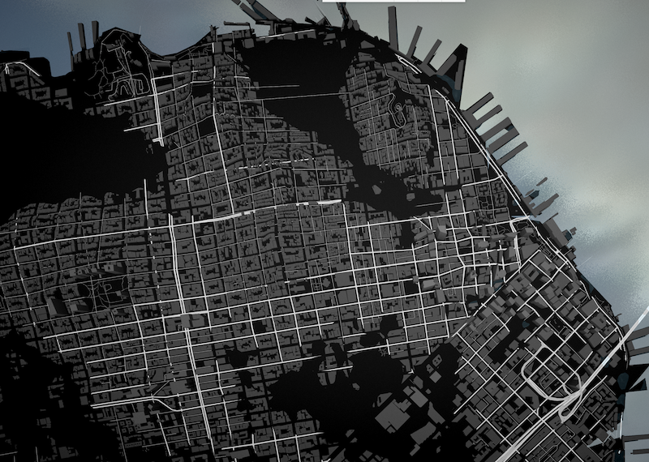

# Terrarium

## Process

### Approach A: One big image to rule them all 

#### Data Sources

* [Shuttle Radar Topography Mission](http://www2.jpl.nasa.gov/srtm/) through [Derek Watkins’s](https://twitter.com/dwtkns) [tool](http://dwtkns.com/srtm30m/)

* [OpenStreetMap](http://www.openstreetmap.org/)

* [Mapzen’s vector tiles](https://mapzen.com/projects/vector-tiles)

#### Log

My first approach was to download a heightmap from the [Shuttle Radar Topography Mission](http://www2.jpl.nasa.gov/srtm/) through [Derek Watkins’s](https://twitter.com/dwtkns) [tool](http://dwtkns.com/srtm30m/) and simply project the vertices on the vertex shader.


Once I download and unzip the tile from [Shuttle Radar Topography Mission](http://www2.jpl.nasa.gov/srtm/). I convert it to a PNG using [gdal](https://www.mapbox.com/tilemill/docs/guides/gdal/):

```bash
wget http://e4ftl01.cr.usgs.gov/SRTM/SRTMGL1.003/2000.02.11/N37W123.SRTMGL1.hgt.zip
tar xzvf N37W123.SRTMGL1.hgt.zip
gdal_translate -ot Int16 -of PNG N37W123.hgt N37W123.png
```

Downloading and inspecting the [JSON file with the bounding boxes](http://dwtkns.com/srtm30m/srtm30m_bounding_boxes.json) from [Derek Watkins’s](https://twitter.com/dwtkns) [tool](http://dwtkns.com/srtm30m/), I determine the boundaries of that tile. Which then I export to webmercator:

```
[-13692328.289900804, -13580946.954451224, 4439068.068371599, 4579465.0539420955]
```

Later I feed this values into a vertex shader on [Mapzen’s Map Engine](https://github.com/tangrams/tangram) together with a ```MINZ``` and ```MAXZ``` for the elevation range

```yams
geometry-terrain:
        animated: true
        mix: [generative-caustic, geometry-matrices, functions-map, filter-grain]
        shaders:
            uniforms:
                u_terrain: data/A/N37W123.png
                u_water_height: 0.
            defines:
                XMIN: -13692328.289900804
                XMAX: -13580946.954451224
                YMIN: 4439068.068371599
                YMAX: 4579465.0539420955
                ZMIN: -10.0
                ZMAX: 800.0
            blocks:
                global: |
                    bool inZone(vec2 _worldPos) {
                        return  _worldPos.x > XMIN && _worldPos.x < XMAX &&
                                _worldPos.y > YMIN && _worldPos.y < YMAX;
                    }

                    float getNormalHeight(vec2 position) {
                        vec2 worldPos = u_map_position.xy + position.xy;
                        if (inZone(worldPos)) {
                            vec2 st = vec2(0.0);
                            st.x = (worldPos.x-XMIN)/(XMAX-XMIN);
                            st.y = (worldPos.y-YMIN)/(YMAX-YMIN);
                            return texture2D(u_terrain, st).r;
                        } else {
                            return 1.1;
                        }
                    }

                    void extrudeTerrain(inout vec4 position) {
                        vec2 pos = position.xy;
                        float height = getNormalHeight(pos.xy);
                        if (height <= 1.0) {
                            position.z += ZMIN+height*(ZMAX-ZMIN);
                        }
                    }
```

In the above code you can see how I’m checking if the vertex is inside the zone for what I have elevation data. If that’s true it perform the extrusion of the vertices.



As can be notice the Polygons form the ```earth``` layer on OSM don’t have enough subdivisions and the vertices are extruded in a way that hide important features like roads and buildings (notice the errors generated on the image bellow).


To fix this I start making a custom set of plane tiles with subdivisions on important corners ( coming from polygons and lines from OSM ```earth```, ```roads``` and ```landuse``` layers)


In this way by breaking the tiles into small fragments the extortion of the terrain don’t hide geometry.


The creation of the necessary tiles could be done running the script

```bash
cd data
./makeATiles.py
```

Once the tiles are done and you watch the map in higher zoom levels could be appreciated a new problem. 

[buildings error](imgs/01-buildings.png)

The top of the buildings have been extrude according to the heightmap but in a incongruent way. To fix this issue a new approach had to be develop


### Approach B: an image per tile

#### Data Sources

* [Mapzen’s elevation data](https://mapzen.com/documentation/elevation/elevation-service/)

* [OpenStreetMap](http://www.openstreetmap.org/)

* [Mapzen’s vector tiles](https://mapzen.com/projects/vector-tiles)

#### Log

In order to solve the incongruence on building extrusion I thought will be beneficial to have control over the heightmap. For that a new set of tiles need to be develop. Each tile will have a double format of GeoJSON and PNG Images. The first will store the geometries explained on the previous log plus the addition of building vertices, together with that a PNG image will be compose to store the elevation data in useful way to make coherent. For that I will fetch the elevation for just the present vertices using [Mapzen’s elevation service](https://mapzen.com/documentation/elevation/elevation-service/) and construct voronoi tiled images from them.


The idea behind this approach is that vertices will fill ‘cells’ with a similar elevation. On the case of the buildings, all vertices should have the same height, and each cell of each corner will have the same value. This will work as a leveled “platform” for the building to rest with out distorting the roof elevation from the original.

## Requirements

- Install PyProj

```bash
pip install pyproj
```

- Install [Requests](http://docs.python-requests.org/en/latest/user/install/#install)

```bash
pip install requests
```

- Install Shapely:

```bash
pip install shapely 
```

- Install [TileStache](https://github.com/TileStache/TileStache)

```bash
pip install TileStache 
```

## Terrain Tiles building process

```bash
cd src/
./makeTiles.py 111968 3-17
```
